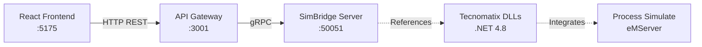

# SimBridge Architecture Diagram

## Stack
- **Frontend**: React + TypeScript + Vite (Browser)
- **API Gateway**: Express + Node.js (REST → gRPC bridge)
- **SimBridge Server**: .NET 4.8 Console App (gRPC Server)
- **Tecnomatix**: Process Simulate eMServer (Legacy .NET 4.8)

## Communication Flow
1. User clicks "Test Load Study" in React UI
2. React calls `fetch('http://localhost:3001/api/load-study')`
3. API Gateway receives HTTP POST, forwards to gRPC
4. SimBridge Server processes via Tecnomatix API (or Mock)
5. Response flows back: gRPC → REST → React
