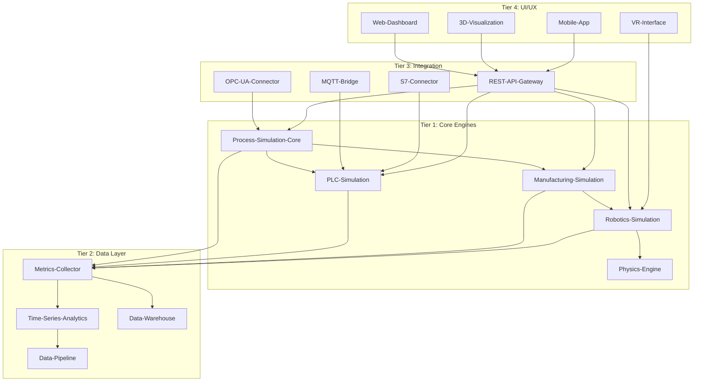

# Repository Integration & Dependency Map

## Core Integration Architecture



## Detailed Integration Requirements

### 1. Process-Simulation-Core Integration Points

```yaml
Inputs:
  - OPC-UA-Connector: Real-time process data
  - Config-Manager: Simulation parameters
  - Model-Converter: CAD/STEP files
  
Outputs:
  - Metrics-Collector: Performance metrics
  - Time-Series-Analytics: Time-based data
  - 3D-Visualization: Visual representation
  
Dependencies:
  - NumPy >= 1.21.0
  - SciPy >= 1.7.0
  - Python >= 3.8
  
API Endpoints:
  - POST /api/simulation/start
  - GET /api/simulation/{id}/status
  - GET /api/simulation/{id}/results
  - DELETE /api/simulation/{id}/cancel
  
Data Format:
  - Input: JSON/MessagePack
  - Output: JSON/CSV/Parquet
  - Real-time: WebSocket/gRPC
```

### 2. PLC-Simulation Integration

```yaml
Supported PLCs:
  - Siemens S7-300/400/1200/1500
  - Allen-Bradley ControlLogix
  - Schneider Modicon
  - Mitsubishi MELSEC
  - Beckhoff TwinCAT
  
Communication Protocols:
  - S7 Protocol (Siemens)
  - EtherNet/IP (Allen-Bradley)
  - Modbus TCP/RTU
  - OPC UA
  - PROFINET
  
Integration Flow:
  1. PLC program upload via S7-Connector
  2. Parse and validate logic
  3. Simulate I/O behavior
  4. Return test results
  5. Generate compliance report
  
Required Libraries:
  - python-snap7 >= 1.2
  - pymodbus >= 2.5.3
  - opcua >= 0.98.13
```

### 3. Manufacturing-Simulation Dependencies

```python
# Core dependencies
dependencies = {
    "process_simulation_core": "^2.0.0",
    "physics_engine": "^1.5.0",
    "robotics_simulation": "^3.1.0",
    "discrete_event_simulation": "^1.2.0"
}

# External integrations
integrations = {
    "erp_systems": ["SAP", "Oracle", "Microsoft Dynamics"],
    "mes_systems": ["Siemens MES", "Wonderware", "AVEVA"],
    "scada": ["WinCC", "FactoryTalk", "Ignition"],
    "databases": ["PostgreSQL", "MongoDB", "InfluxDB"]
}

# Data exchange formats
data_formats = {
    "input": ["ISA-95", "B2MML", "OPC UA"],
    "output": ["JSON", "XML", "CSV", "Parquet"],
    "real_time": ["MQTT", "Kafka", "WebSocket"]
}
```

### 4. Robotics-Simulation Requirements

```yaml
Robot Brands Supported:
  - ABB
  - KUKA
  - Fanuc
  - Universal Robots
  - Yaskawa/Motoman
  
Simulation Capabilities:
  - Path planning
  - Collision detection
  - Cycle time optimization
  - Energy consumption
  - Payload analysis
  
Integration with:
  - ROS/ROS2
  - MoveIt
  - Gazebo
  - V-REP/CoppeliaSim
  
Output Formats:
  - Robot programs (KRL, RAPID, TP)
  - Simulation videos (MP4)
  - Performance reports (PDF)
  - Path data (CSV)
```

### 5. Data Flow Architecture

```python
# Data flow between repositories
data_flow = {
    "real_time_data": {
        "source": ["OPC-UA-Connector", "MQTT-Bridge", "S7-Connector"],
        "processor": "Data-Pipeline",
        "storage": "Time-Series-Analytics",
        "visualization": ["Web-Dashboard", "3D-Visualization"]
    },
    
    "batch_processing": {
        "source": ["File uploads", "Database exports"],
        "processor": "Process-Simulation-Core",
        "analytics": "ML-Optimization-Engine",
        "reporting": "Report-Generator"
    },
    
    "event_driven": {
        "triggers": ["Alert-Manager", "Predictive-Maintenance-AI"],
        "handlers": ["Production-Scheduler", "Energy-Optimization"],
        "notifications": ["Mobile-App", "Email-Service"]
    }
}
```

## Inter-Repository Communication

### Message Queue Architecture

```yaml
Kafka Topics:
  simulation.requests:
    Producers: [REST-API-Gateway, Web-Dashboard]
    Consumers: [Process-Simulation-Core, PLC-Simulation]
    
  simulation.results:
    Producers: [Process-Simulation-Core, PLC-Simulation]
    Consumers: [Metrics-Collector, Report-Generator]
    
  real-time.data:
    Producers: [OPC-UA-Connector, MQTT-Bridge]
    Consumers: [Digital-Twin-Framework, Time-Series-Analytics]
    
  alerts.critical:
    Producers: [Alert-Manager, Predictive-Maintenance-AI]
    Consumers: [Mobile-App, Email-Service, Web-Dashboard]
```

### REST API Integration

```javascript
// Unified API structure across repositories
const apiStructure = {
  baseUrl: "https://api.simupro.io/v1",
  
  services: {
    simulation: {
      endpoints: [
        "POST /simulation/process",
        "POST /simulation/plc",
        "POST /simulation/robotics",
        "POST /simulation/manufacturing"
      ],
      repos: ["Process-Simulation-Core", "PLC-Simulation", "Robotics-Simulation"]
    },
    
    data: {
      endpoints: [
        "GET /metrics",
        "GET /analytics",
        "GET /reports"
      ],
      repos: ["Metrics-Collector", "Time-Series-Analytics", "Report-Generator"]
    },
    
    integration: {
      endpoints: [
        "POST /opcua/subscribe",
        "POST /mqtt/publish",
        "GET /plc/tags"
      ],
      repos: ["OPC-UA-Connector", "MQTT-Bridge", "S7-Connector"]
    }
  }
};
```

## Database Schema Coordination

### Shared Database Tables

```sql
-- Core tables used by multiple repositories
CREATE TABLE simulations (
    id UUID PRIMARY KEY,
    type VARCHAR(50), -- process, plc, robotics, manufacturing
    status VARCHAR(20), -- pending, running, completed, failed
    created_by VARCHAR(100),
    created_at TIMESTAMP,
    completed_at TIMESTAMP,
    repository VARCHAR(50), -- which repo handles this
    config JSONB,
    results JSONB
);

CREATE TABLE metrics (
    id BIGSERIAL PRIMARY KEY,
    simulation_id UUID REFERENCES simulations(id),
    repository VARCHAR(50),
    metric_name VARCHAR(100),
    metric_value NUMERIC,
    timestamp TIMESTAMP,
    tags JSONB
);

CREATE TABLE integrations (
    id UUID PRIMARY KEY,
    source_repo VARCHAR(50),
    target_repo VARCHAR(50),
    integration_type VARCHAR(50), -- api, message_queue, database
    config JSONB,
    active BOOLEAN DEFAULT true
);
```

## Version Compatibility Matrix

| Repository | Version | Compatible With | Breaking Changes |
|------------|---------|-----------------|------------------|
| Process-Simulation-Core | 2.0.0 | All current | v1.x deprecated |
| PLC-Simulation | 1.5.0 | PSC 2.0+ | None |
| Manufacturing-Simulation | 3.1.0 | PSC 2.0+, RS 3.0+ | API changes in v3.0 |
| Robotics-Simulation | 3.0.0 | PE 1.5+ | New physics engine |
| Physics-Engine | 1.5.0 | Stable | None |
| OPC-UA-Connector | 2.2.0 | All current | None |
| REST-API-Gateway | 4.0.0 | All current | GraphQL added |
| Web-Dashboard | 5.0.0 | API 4.0+ | React 18 upgrade |

## Critical Integration Paths

### Path 1: Real-time PLC Monitoring
```
S7-Connector → PLC-Simulation → Metrics-Collector → Time-Series-Analytics → Web-Dashboard
```

### Path 2: Manufacturing Line Optimization
```
OPC-UA-Connector → Manufacturing-Simulation → ML-Optimization-Engine → Production-Scheduler
```

### Path 3: Robotics Path Planning
```
CAD-Viewer → Model-Converter → Robotics-Simulation → Physics-Engine → 3D-Visualization
```

### Path 4: Predictive Maintenance
```
Metrics-Collector → Time-Series-Analytics → Predictive-Maintenance-AI → Alert-Manager → Mobile-App
```

## Integration Testing Requirements

### Test Scenarios

```python
integration_tests = {
    "test_plc_to_simulation": {
        "repos": ["S7-Connector", "PLC-Simulation", "Process-Simulation-Core"],
        "data_flow": "S7 → PLC-Sim → Process-Sim",
        "expected_latency": "<100ms",
        "success_rate": ">99.9%"
    },
    
    "test_real_time_visualization": {
        "repos": ["Manufacturing-Simulation", "3D-Visualization", "Web-Dashboard"],
        "data_flow": "Simulation → WebSocket → 3D Render",
        "expected_fps": ">30",
        "latency": "<50ms"
    },
    
    "test_data_pipeline": {
        "repos": ["Metrics-Collector", "Data-Pipeline", "Data-Warehouse"],
        "data_flow": "Metrics → Kafka → Warehouse",
        "throughput": ">10,000 msgs/sec",
        "data_loss": "<0.01%"
    }
}
```

## Common Integration Issues

### Known Problems

1. **Version Mismatches**
   - Process-Simulation-Core v1.x incompatible with Manufacturing-Simulation v3.x
   - Solution: Upgrade PSC to v2.0+

2. **Data Format Inconsistencies**
   - Different repos use different timestamp formats
   - Solution: Standardize on ISO 8601

3. **Authentication Conflicts**
   - Multiple auth systems across repos
   - Solution: Implement SSO via REST-API-Gateway

4. **Performance Bottlenecks**
   - Data-Pipeline struggles with >5000 msgs/sec
   - Solution: Implement batching and compression

5. **Missing Error Handling**
   - Many repos don't handle downstream failures
   - Solution: Implement circuit breakers

## Recommended Integration Priority

### Phase 1: Core Loop (Month 1)
```
PLC-Simulation ↔ S7-Connector ↔ Web-Dashboard
```

### Phase 2: Data Flow (Month 2)
```
Add: Metrics-Collector → Time-Series-Analytics → KPI-Dashboard
```

### Phase 3: Advanced Features (Month 3)
```
Add: Manufacturing-Simulation → ML-Optimization-Engine → Report-Generator
```

### Phase 4: Full Platform (Month 4-6)
```
Integrate remaining repositories based on customer requirements
```