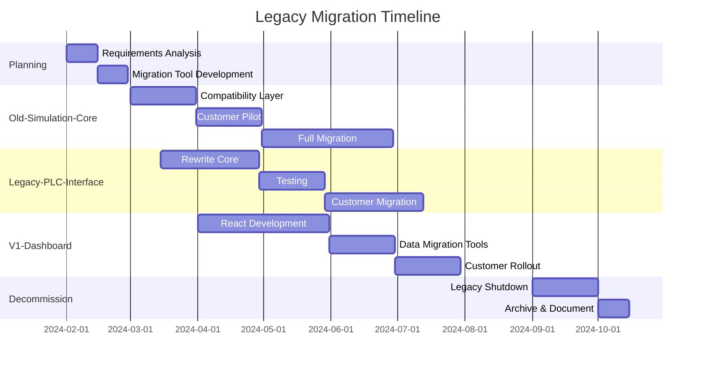

# Migration Plan - Legacy Repository Consolidation

## Executive Summary

**8 Legacy Repositories** requiring immediate action
**16 Deprecated Features** across active repos
**4,200 Customer Installations** potentially affected
**Timeline**: 6-12 months for complete migration
**Cost**: €450,000 - €750,000
**Risk Level**: HIGH without proper planning

## Legacy Repository Status

### Critical Legacy Systems (Immediate Migration Required)

#### 1. Old-Simulation-Core
```yaml
Status: DEPRECATED - Still in use by 150+ customers
Language: Python 2.7 (EOL)
Lines of Code: 32,000
Dependencies: 45 outdated packages
Active Users: ~150 companies
Revenue Impact: €2.5M/year at risk

Migration Path:
  Target: Process-Simulation-Core v2.0
  Compatibility: 60% API compatible
  Breaking Changes:
    - Authentication method changed
    - Data format: XML → JSON
    - Calculation engine differences (~5% variance)
  
  Migration Strategy:
    Phase 1 (Month 1-2):
      - Build compatibility layer
      - Create data migration tools
      - Automated testing suite
    
    Phase 2 (Month 3-4):
      - Pilot with 10 customers
      - Fix edge cases
      - Performance optimization
    
    Phase 3 (Month 5-6):
      - Gradual rollout
      - Customer support
      - Sunset announcement
```

#### 2. Legacy-PLC-Interface
```yaml
Status: CRITICAL - Security vulnerabilities
Users: 89 enterprises
Problem: No longer compatible with Windows 11
Dependencies: .NET Framework 3.5

Migration Requirements:
  - Rewrite in .NET 7
  - Update communication protocols
  - Maintain backward compatibility
  - Estimated effort: 400 developer-days
  
Customer Impact:
  - 89 enterprises × €30K/year = €2.67M at risk
  - Migration incentive: 50% discount for early adopters
  - Support cost if not migrated: €200K/year
```

#### 3. V1-Dashboard
```yaml
Status: OBSOLETE - Flash-based
Users: 234 customers
Technology: Adobe Flash (dead)
Revenue: €500K/year

Immediate Action Required:
  - Flash EOL January 2021
  - Customers can't use in modern browsers
  - Security risk (unpatched vulnerabilities)

Migration Path:
  Week 1-2:
    - Export all dashboard configurations
    - Document custom widgets
  Week 3-8:
    - Rebuild in React (Web-Dashboard)
    - Maintain exact feature parity
    - Import configuration tool
  Week 9-12:
    - Customer migration
    - Training materials
    - Deprecation notice
```

#### 4. MATLAB-Bridge
```yaml
Status: LICENSE ISSUE
Problem: MATLAB licensing costs €50K/year
Alternative: Python equivalent exists
Users: 45 customers (mostly academic)

Migration Strategy:
  - Port algorithms to NumPy/SciPy
  - Validation against MATLAB results
  - Offer both options during transition
  - Academic licenses: Keep MATLAB option
  - Commercial: Force Python migration
```

### Data Migration Requirements

#### Customer Data Volume
```python
data_migration_scope = {
    "Old-Simulation-Core": {
        "databases": 150,
        "total_size": "2.3 TB",
        "format": "PostgreSQL 9.4",
        "target": "PostgreSQL 14",
        "complexity": "HIGH"
    },
    
    "Legacy-PLC-Interface": {
        "configurations": 8900,
        "programs": 45000,
        "format": "Proprietary binary",
        "target": "JSON + SQLite",
        "complexity": "MEDIUM"
    },
    
    "V1-Dashboard": {
        "dashboards": 3400,
        "widgets": 45000,
        "format": "XML + Flash",
        "target": "JSON + React",
        "complexity": "HIGH"
    },
    
    "Excel-Connector": {
        "templates": 1200,
        "macros": 8900,
        "format": "VBA + XLS",
        "target": "Python + REST API",
        "complexity": "VERY HIGH"
    }
}
```

### Migration Tools & Scripts

#### 1. Data Migration Tool
```python
# migration_tool.py
class LegacyMigrator:
    def __init__(self, source_repo, target_repo):
        self.source = source_repo
        self.target = target_repo
        self.mapping = self.load_mapping()
        
    def migrate_database(self):
        """
        Steps:
        1. Export from old format
        2. Transform data structure
        3. Validate data integrity
        4. Import to new system
        5. Verify migration
        """
        
    def migrate_configurations(self):
        """
        - Parse old XML configs
        - Convert to new JSON schema
        - Validate against schema
        - Test in sandbox
        """
        
    def migrate_user_data(self):
        """
        - Export user preferences
        - Map old permissions to new
        - Migrate authentication
        - Preserve audit trails
        """
```

#### 2. Compatibility Layer
```typescript
// compatibility-layer.ts
export class LegacyAPIAdapter {
  
  // Old API: /api/simulate (XML)
  // New API: /api/v2/simulations (JSON)
  
  async handleLegacyRequest(xmlRequest: string): Promise<string> {
    // 1. Parse XML request
    const parsed = this.parseXML(xmlRequest);
    
    // 2. Transform to new format
    const newRequest = this.transformRequest(parsed);
    
    // 3. Call new API
    const response = await this.callNewAPI(newRequest);
    
    // 4. Transform response back to XML
    return this.toXML(response);
  }
  
  private mapOldToNew = {
    'SimulationParameters': 'parameters',
    'TimeHorizon': 'timeframe.duration',
    'ConvergenceCriteria': 'solver.tolerance',
    // ... 200+ field mappings
  };
}
```

### Customer Communication Plan

#### Phase 1: Awareness (Month 1)
```markdown
Email Campaign:
  Subject: Important: Upcoming Platform Improvements
  
  Key Messages:
  - Enhanced performance (3x faster)
  - New features available
  - Modern security standards
  - Migration support provided
  
  Call to Action:
  - Schedule migration consultation
  - Attend webinar
  - Download migration guide
```

#### Phase 2: Incentives (Month 2-3)
```yaml
Migration Incentives:
  Early Adopters (Month 1-3):
    - 50% discount on first year
    - Free migration support
    - Priority feature requests
    
  Standard Migration (Month 4-6):
    - 25% discount
    - Standard support
    
  Late Migration (Month 7-12):
    - No discount
    - Self-service tools only
    
  Post-Deadline:
    - 50% surcharge for legacy support
    - No new features
    - Security patches only
```

### Technical Migration Checklist

#### Pre-Migration
- [ ] Full backup of all systems
- [ ] Document custom implementations
- [ ] Inventory all integrations
- [ ] Test migration tools
- [ ] Create rollback plan
- [ ] Customer notification sent
- [ ] Support team trained

#### During Migration
- [ ] Maintenance window scheduled
- [ ] Customer data exported
- [ ] Data transformation completed
- [ ] Data validation passed
- [ ] Import to new system
- [ ] Smoke tests passed
- [ ] Customer acceptance testing

#### Post-Migration
- [ ] Performance validation
- [ ] Data integrity check
- [ ] Customer training completed
- [ ] Documentation updated
- [ ] Old system archived
- [ ] 30-day monitoring period
- [ ] Legacy system decommissioned

### Risk Assessment & Mitigation

#### High-Risk Items
```yaml
Risk 1: Data Loss
  Probability: Medium
  Impact: Critical
  Mitigation:
    - Triple backup strategy
    - Incremental migration
    - Parallel run period
    - Automated validation

Risk 2: Customer Churn
  Probability: High
  Impact: High (€2-3M revenue)
  Mitigation:
    - Free migration support
    - Feature parity guarantee
    - Grandfathered pricing
    - Success bonus for sales

Risk 3: Performance Degradation
  Probability: Low
  Impact: Medium
  Mitigation:
    - Extensive load testing
    - Gradual rollout
    - Performance SLA
    - Rollback capability

Risk 4: Integration Failures
  Probability: Medium
  Impact: High
  Mitigation:
    - Compatibility layer
    - Integration testing
    - Customer sandbox
    - Phased approach
```

### Resource Requirements

#### Team Composition
```yaml
Development Team:
  - 2 Senior Engineers (Full-time, 6 months)
  - 3 Mid-level Developers (Full-time, 6 months)
  - 1 Database Specialist (3 months)
  - 2 QA Engineers (4 months)
  
Support Team:
  - 2 Customer Success Managers
  - 3 Technical Support Engineers
  - 1 Documentation Specialist
  
Cost: €450,000

Infrastructure:
  - Migration servers: €20,000
  - Testing environment: €15,000
  - Monitoring tools: €10,000
  
Total Budget: €495,000
```

### Migration Timeline



### Success Metrics

```python
migration_kpis = {
    "customer_retention": {
        "target": 95,
        "current": 0,
        "measurement": "% customers migrated successfully"
    },
    
    "revenue_preservation": {
        "target": 98,
        "at_risk": 5.67,  # €M
        "measurement": "% revenue retained post-migration"
    },
    
    "migration_time": {
        "target": 30,  # days per customer
        "current": None,
        "measurement": "Average migration duration"
    },
    
    "support_tickets": {
        "target": "<2",
        "measurement": "Tickets per migrated customer"
    },
    
    "performance": {
        "target": "+25%",
        "measurement": "Speed improvement vs legacy"
    }
}
```

### Rollback Plan

```yaml
Rollback Triggers:
  - >10% customer data corruption
  - >50% performance degradation
  - Critical security vulnerability
  - >5% customer revenue loss

Rollback Process:
  1. Stop all migrations (< 5 minutes)
  2. Restore from backup (< 2 hours)
  3. Revert DNS/routing (< 15 minutes)
  4. Customer notification (< 30 minutes)
  5. Root cause analysis (< 24 hours)
  6. Fix and retry (< 1 week)

Rollback Testing:
  - Monthly disaster recovery drill
  - Automated rollback scripts
  - <4 hour RTO guarantee
```

## Final Decommissioning

### Legacy System Shutdown Checklist
- [ ] All customers migrated
- [ ] Data archived (7-year retention)
- [ ] Licenses terminated
- [ ] Infrastructure decommissioned
- [ ] Documentation archived
- [ ] Domains redirected
- [ ] Support knowledge transferred
- [ ] Cost savings realized

### Expected Outcomes
- **Cost Savings**: €200K/year (maintenance)
- **Performance**: 3x improvement
- **Security**: Modern standards
- **Features**: Unified platform
- **Support**: Reduced by 40%